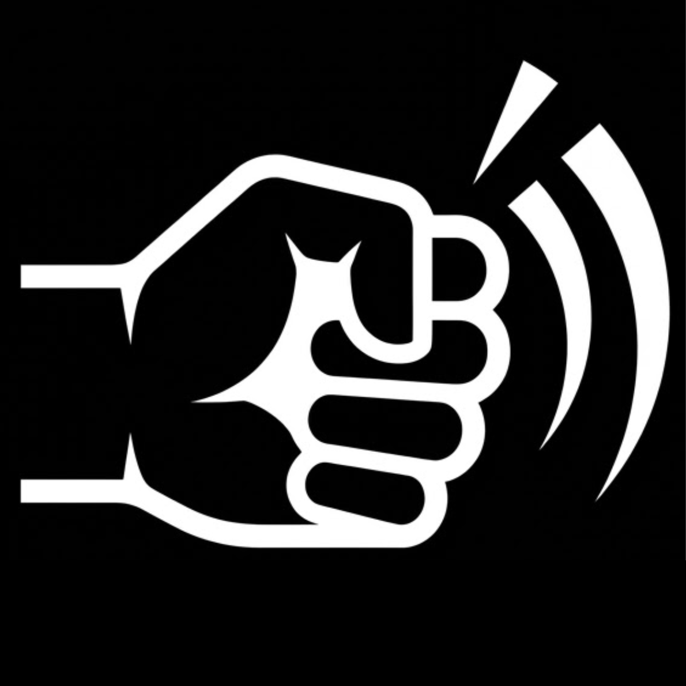

<p align="center">
  
</p>

<h1 align="center">Bonk 👊</h1>

<p align="center">
  <b>Knock on your MacBook. Make it do things.</b><br>
  A free, open-source macOS menu bar app that turns physical knocks on your laptop's chassis
  into commands — play/pause, lock screen, keyboard shortcuts, shell scripts, Shortcuts, anything.
</p>

<p align="center">
  <a href="https://github.com/Alex-duh/Bonk/releases/latest/download/Bonk.dmg"><b>⬇ Download Bonk.dmg</b></a>
  ·
  <a href="https://trybonk.vercel.app/">Website</a>
  ·
  
</p>

---

Knock up to four times in a row anywhere on your MacBook — palm rest, lid, next to the trackpad. Each pattern triggers **any action you choose**: single knock can skip tracks, double knock can switch tabs, triple knock can run a shell script — every pattern is fully remappable in Settings, per app if you want. No extra hardware: Bonk reads the accelerometer that's already inside every Apple Silicon MacBook.

**100% local.** No backend, no network calls, no analytics, no account. Your knocks never leave your machine.

## Install (2 minutes)

1. Download `Bonk-x.y.z.dmg` from the [latest release](https://github.com/Alex-duh/Bonk/releases/latest).
2. Open it and drag **Bonk** into **Applications**.
3. First launch: **right-click Bonk.app → Open → Open**. *(Once. See below for why.)*
4. Grant **Accessibility** when asked — it's how Bonk presses keyboard shortcuts on your behalf (and how it notices you're typing so it can ignore those vibrations).
5. A 👊 appears in your menu bar. Knock twice on your palm rest — your screen locks. That's just the out-of-the-box default: open **Settings** from the 👊 menu and point each knock pattern (single through quad) at any action from the table below.

> [!NOTE]
> **Why the "unidentified developer" warning?** Bonk isn't notarized by Apple yet (that requires a $99/year developer account I can't afford 😔). The warning does **not** mean the app is unsafe — it means Apple hasn't scanned it. The entire source code is right here in this repo, and you can build it yourself with one command if you'd rather not trust the binary. To open it anyway: **right-click the app → Open → Open** (only needed the first time). If macOS says the app "is damaged", run `xattr -cr /Applications/Bonk.app` in Terminal once.

**Requirements:** Apple Silicon MacBook (M1 or later) running **macOS 26 (Tahoe) or newer**. Intel Macs and desktops have no accelerometer. macOS 13–15 (Sequoia and earlier) have the sensor but block apps from reading it at the system level — verified through 15.7, even with root — so Bonk cannot work there. Check any Mac with:
```bash
/Applications/Bonk.app/Contents/MacOS/Bonk --probe
```

## What can a knock do?

| Category | Actions |
|---|---|
| Built-ins | Play/Pause, Next/Previous Track, Volume, Mute, Lock Screen, Sleep, Screenshot, Mission Control, Spotlight, App Switcher, Tab/Desktop switching, Copy/Paste/Undo/Redo, … |
| **Any keyboard shortcut** | Type it as text: `cmd+shift+4`, `ctrl+opt+right`, `fn+f11`, … |
| **Any app** | Launch by name or Browse… to pick it |
| **Any shell command** | Runs in zsh: `open https://mail.google.com`, `caffeinate -d -t 3600`, … |
| **Any Shortcuts.app shortcut** | Pick from a dropdown of your shortcuts — automate literally anything |
| **AI Accept** | Sends ⏎ to the frontmost app — accept a Claude Code / Cursor / Copilot suggestion by knocking on your laptop instead of reaching for the keyboard |

### Per-app overrides

Different apps, different knocks. A rule like *"when **Terminal** is frontmost, double knock = AI Accept"* overrides your global mapping only in Terminal. Add as many rules as you like in Settings.

## Getting it dialed in

- **Knock to Calibrate** — click it, knock 3× at your natural strength, done. The threshold is set to half your softest knock.
- **Test mode** — detect and log knocks *without* firing any actions, so you can tune sensitivity risk-free (toggle in the menu bar or Settings).
- **Live waveform** — Settings shows a real-time 100 Hz trace of chassis vibration with your threshold drawn on it, plus a detector status line that tells you *why* the last knock did or didn't count.
- **Four sliders, each explained in-app** — sensitivity threshold, knock window, cooldown, and max knock duration.
- Typing is automatically ignored (keystrokes suppress detection for 800 ms), and tilting/moving the laptop doesn't false-trigger thanks to a slow-adapting gravity baseline.

## How it works

1. Apple Silicon MacBooks contain a MEMS accelerometer, exposed as an IOKit HID device (`AppleSPUHIDDevice`). Bonk reads it at ~100 Hz. (CoreMotion doesn't work on macOS — this is the only way in.)
2. An exponential moving average (α = 0.02) tracks gravity + slow drift, so only *sudden* changes count. Tilting the laptop shifts the baseline; a knock spikes above it.
3. A spike becomes a knock only if it's sharp (sustained vibration over ~120 ms — fans, desk wobble — is rejected), clears the sensitivity threshold, and isn't within 80 ms of the previous knock (sensor ringing).
4. Knocks within a 450 ms window group into a pattern (single, double, triple, or quad), which dispatches your configured action — checked first against per-app rules for the frontmost app, then the global mapping.

Everything runs in a single lightweight process on the main run loop; idle CPU usage is negligible.

## Build from source

```bash
git clone https://github.com/Alex-duh/Bonk.git
cd Bonk
bash build_app.sh        # build + bundle + launch (needs Xcode Command Line Tools)
```

`package_dmg.sh` builds the distributable .dmg. Note for contributors: rebuilds change the ad-hoc code signature, so macOS revokes the Accessibility permission after every build — re-grant it in System Settings before testing.

## Troubleshooting

| Problem | Fix |
|---|---|
| 👊⚠️ in the menu bar | Sensor sent no data — usually macOS 15 or earlier (Bonk needs macOS 26+), an Intel Mac, or a desktop. Run `/Applications/Bonk.app/Contents/MacOS/Bonk --probe` in Terminal to check. |
| Knocks detected but nothing happens | Grant **Accessibility** (Privacy & Security → Accessibility). Also check Test mode isn't on. |
| Missed knocks | Run **Knock to Calibrate**, or lower the threshold slider. Knock near the trackpad — it's closest to the sensor. |
| False triggers | Raise the threshold or extend the cooldown. Setting things down on the desk hard can look like a knock. |
| Debug log | `~/Library/Logs/Bonk.log` records every action fired and every error. |

## License

[GPL-3.0](LICENSE). Bonk is free and always will be. You're welcome to use, study, modify, and redistribute it — but any distributed fork must remain open source under the same license. Improvements belong in the commons; if you build something cool on top of it, send a PR instead of a paywall.
